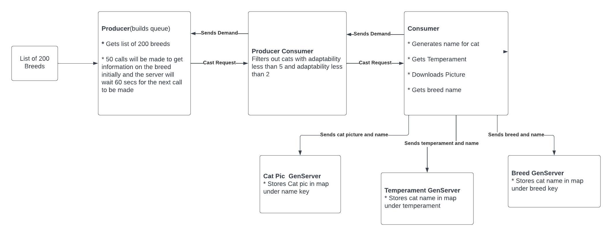

# Mocktail

**Description**

This is a learning excercise to practice what I have learned in Elixir using Gen 
Servers Producers, Producer/Consumers, and Consumers
with an external API. Using these tools the aim is to download pictures of smart 
active cats!

The app is given a [list of breeds](lib/mocktail/breed_list.ex) 

The [producer](lib/mocktail/producer.ex) pulls from this list and passes them to the 
producer_consumer

The [producer_consumer](lib/mocktail/producer_consumer.ex) then filters the cats. We 
only want pictures of cats with an energy level greater than 5 and adaptability of 
greater than 2

The [consumer](lib/mocktail/consumer.ex) then generates a name for the cat, gets the 
temperaments of the cat, full breed name, and downloads a picture. The cat picture is
sent to the [pic_server](lib/mocktail/pic_server.ex) where it is stored in a map with
the name as a key, the cats temparement and name is sent to the [temparment_server](lib/mocktail/temperament_server.ex)
here the cats name is stored in a list under the keys of its temperaments, and finally
the name and breed are sent to the [cat_breed_server](lib/mocktail/cat_breed_server.ex) 
where the name of the cat is stored in a list under the key of the cat breed.

While this is happening a list of available breeds and temperaments are printed in the
console.

We now have our cat information stored in the state of our three GenServers [cat_breed_server](lib/mocktail/cat_breed_server.ex),
[temparment_server](lib/mocktail/temperament_server.ex), [pic_server](lib/mocktail/pic_server.ex). We can extract this information with the use of the functions below.

`Mocktail.get_breed/1` to get a list of cats of a particular breed

`Mocktail.get_temperament/1` to get a list of cats with a particular temperament

`Mocktail.get_pics_of_breed/1` to download pictures of a particular breed to /cat_pics

`Mocktail.get_pics_of_temperament/1` to downloads pictures of a particular temperament 
to /cat_pics

`Mocktail.get_pics/1` takes a list of cat names and downloads pictures to /cat_pics

`Mocktail.get_pic_of/1` takes a cat's name and downloads pictures to /cat_pics

# Instructions

I use [asdf](https://asdf-vm.com/guide/getting-started.html) to manage my versions of Elixir and Erlang(among others)

Install Erlang 25.2.1

Install Elixir 1.14

clone the repo from Github

get an api key from https://thecatapi.com/#pricing

run `mix deps.get`

start the app with `API_KEY=(your api key here) iex -S mix`

As pictures are downloaded the temperaments and breeds available will print in the console.
Below is a list of functions you can copy and paste if you see thier arguments as `Available`.

`Mocktail.get_breed("Cymric")`

`Mocktail.get_temperament("Gentle")`

`Mocktail.get_pics_of_breed("Balinese")`

`Mocktail.get_pics_of_temperament("Loyal")`
